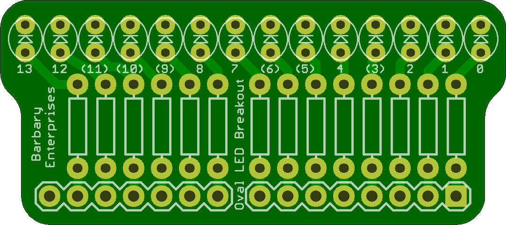

## Led Breakouts for Arduino

These LED Breakouts are designed to be mini shields that you can simply plug into an arduino, and get to blinking those LED's right away. 

## 3MMLedBreakoutForArduino 

### Board dimensions

* (180001, 77500) original units
* (1.8000, 0.7750) inches
* (45.7203, 19.6850) mm

[gerbers](%*_gerber.zip)

| Front | Back |
| --- | --- |
|  |  |

## 5MMLedBreakoutForArduino 

### Board dimensions

* (185000, 110000) original units
* (1.8500, 1.1000) inches
* (46.9900, 27.9400) mm

[gerbers](%*_gerber.zip)

| Front | Back |
| --- | --- |
|  |  |

## OvalLedBreakoutForArduino 

### Board dimensions

* (180000, 80000) original units
* (1.8000, 0.8000) inches
* (45.7200, 20.3200) mm

[gerbers](%*_gerber.zip)

| Front | Back |
| --- | --- |
|  |  |

